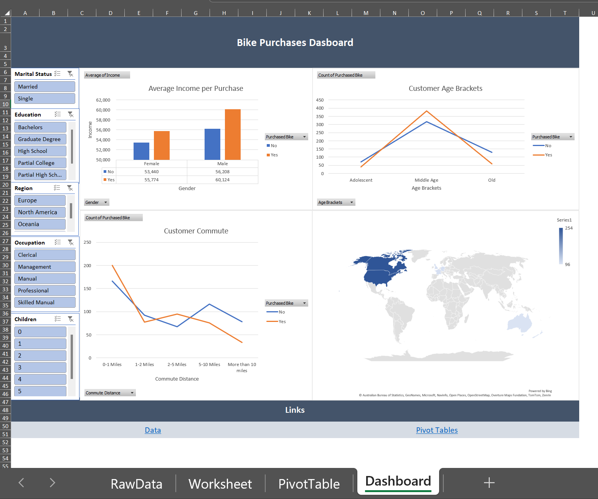
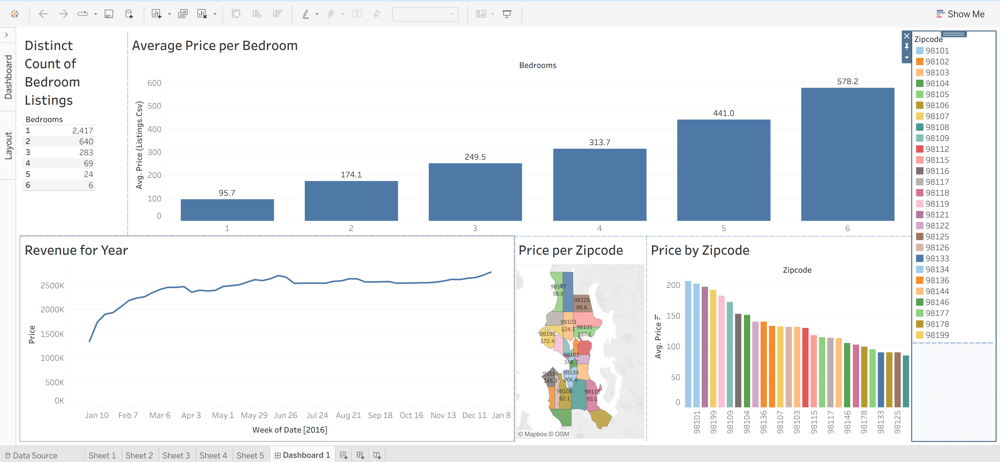
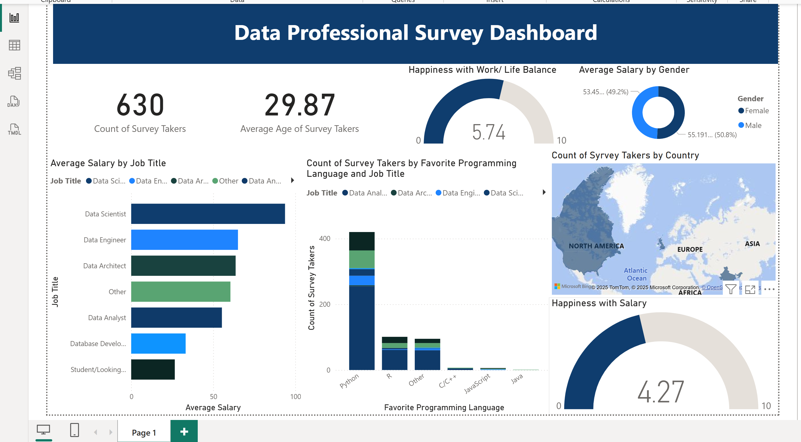

# Data Visualization Projects

A small collection of dashboard projects I built with **Excel**, **Tableau**, and **Power BI**.
Each project starts with raw data → cleaning/transformations → exploratory views (tables, pivot tables, sheets) → a polished, interactive dashboard.

---

## 🔎 Projects

### 1) Bike Purchases – Excel

**Topic:** Consumer bike purchases and demographics
**Goal:** Explore who buys bikes and why using slicers and pivot‑driven visuals.

**Highlights**

* Interactive slicers for **Marital Status**, **Education**, **Region**, **Occupation**, and **Children**
* Charts for:

  * **Average Income per Purchase** (by gender & purchased/not purchased)
  * **Customer Age Brackets**
  * **Commute Distance vs. Purchase**
  * **Geographic distribution** (map)
* Built from cleaned tables and multiple **PivotTables** with calculated fields.

**Screenshot**

---

### 2) Airbnb Seattle – Tableau

**Raw Data:** [Link to Kaggle data set](https://www.kaggle.com/datasets/airbnb/seattle)
**Topic:** Rental data (Seattle): reviews, locations, bedroom counts, pricing
**Goal:** Understand pricing patterns across neighborhoods and bedroom sizes over time.

**Highlights**

* **Avg Price per Bedroom** bar chart (1–6 bedrooms)
* **Revenue over Time** line chart (weekly granularity)
* **Price per Zip Code** filled map + **Price by Zip Code** bar ranking
* Interactive filters (Zip code, Bedrooms) for quick slice‑and‑dice

**Screenshot**

---

### 3) Data Professionals Survey – Power BI

**Topic:** A survey of data professionals about tools, pay, and job satisfaction
**Goal:** Summarize who works with data, what they earn, and how they feel about the work.

**Highlights**

* KPI cards for **Count of Survey Takers** and **Average Age**
* **Happiness (Work/Life)** and **Happiness with Salary** gauges
* **Average Salary by Job Title** (bar chart)
* **Favorite Programming Language** by job title (stacked column)
* **Count by Country** (map)

**Screenshot**

---

## 🧪 Process & Methodology

Across all three projects I followed a repeatable workflow:

1. **Data Intake & Cleaning**

   * Standardize categorical values, fix types, trim whitespace, handle missing/outliers
2. **Modeling & Calculations**

   * Pivot transforms (Excel), Calculated Fields (Tableau), DAX measures (Power BI)
3. **Exploratory Visuals**

   * Quick tables and intermediate charts to validate logic
4. **Dashboard Assembly**

   * Layout grids, consistent labeling, legends, and interactive controls
5. **QA & Performance**

   * Cross‑checks between views, filter testing, and formatting polish

---

## 📈 Key Questions Answered

* **Bike Purchases:** How do **income**, **age**, and **commute distance** relate to purchase behavior across regions and demographics?
* **Airbnb Seattle:** How does **price** vary by **bedroom count** and **zip code**, and what is the **revenue trend** through the year?
* **Data Pros Survey:** Which **job titles** earn the most, which **languages** are favored, and how **satisfied** are respondents?

---